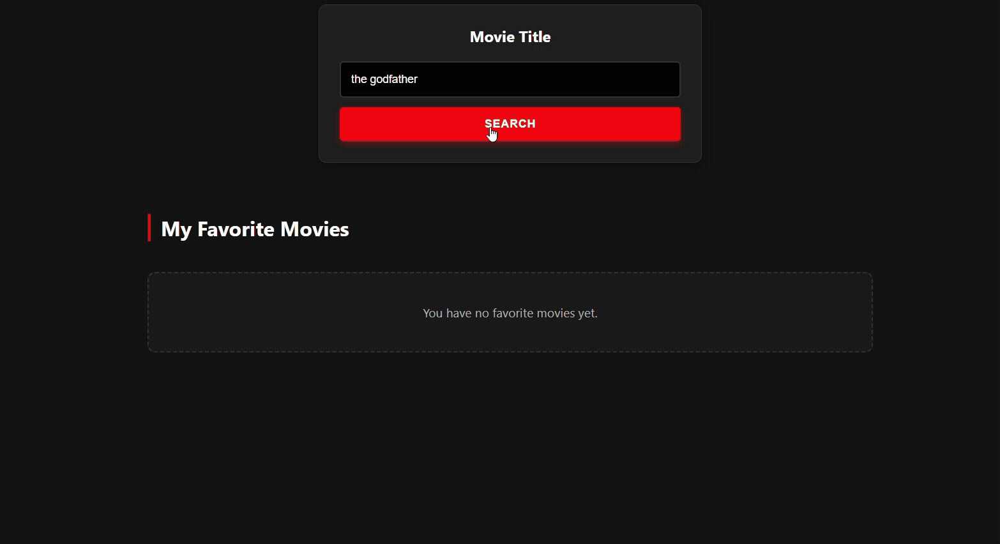

# 🎬 Movie Search & Collections App

A modern React application that allows users to search for movies using the OMDb API, view details, and curate a personal list of favorites. This project represents a key milestone in my frontend development journey, demonstrating mastery of React state management, API integration, and modern CSS styling.

### 🔗 [Live Demo](https://samuadda.github.io/movies_searching_app-React)

## ✨ Features

-   **Search Movies**: Real-time searching using the OMDb API.
-   **Favorites List**: Add and remove movies from your personal collection.
-   **Movie Details**: Click on any movie to view more details in a modal.
-   **Responsive Design**: Fully responsive grid layout that works on desktop and mobile.
-   **Modern UI**: Dark theme, glassmorphism effects, and smooth animations.

## 🛠️ Tech Stack

-   **React.js**: Functional components and Hooks (`useState`, `useEffect`).
-   **CSS3**: Custom properties (variables), Flexbox, Grid, and Animations.
-   **OMDb API**: External data fetching for movie information.
-   **JavaScript (ES6+)**: Async/Await, Array methods (`map`, `filter`).

## 📂 Project Structure

movies_searching_app-React/
├── public/                  # Static assets
├── src/
│   ├── App.css              # Main styling
│   ├── App.js               # Main component
│   ├── FavouriteList.jsx    # Favorites component
│   ├── FavouriteMovie.jsx   # Movie card component
│   ├── index.css            # Global styles
│   ├── index.js             # Entry point
│   └── searchMovies.jsx     # Search component
├── package.json             # Dependencies
└── README.md                # Documentation## 🚀 How to Run Locally

1. **Clone the repository**
    git clone https://github.com/your-username/movie-search-app.git
    2. **Install Dependencies**
    npm install
    3. **Start the App**
    npm start
        The app will open at `http://localhost:3000`.

---
_Built with ❤️ by [Your Name]_
